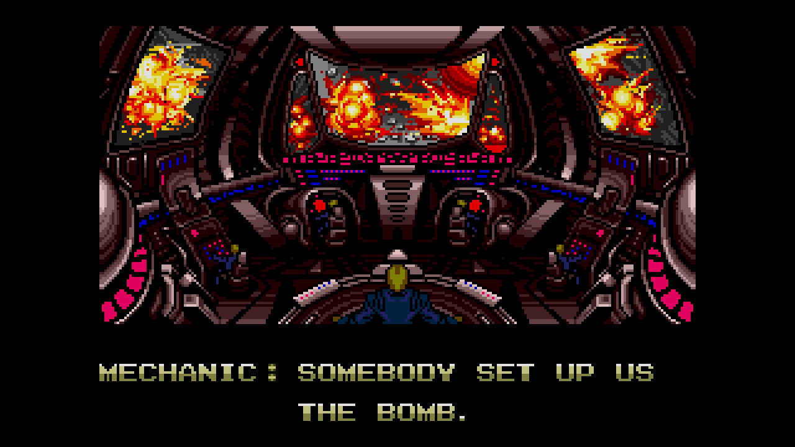

# Somebody set up us the bomb



Benchmarks used in Allon Mureinik's "Somebody set up us the bomb" talk(s).

## Requirements

This benchmark used [Node.js](https://nodejs.org/en/). It was executed using Node.js 17.0.1, but will probably work with 
any reasonably new Node.js version.

## Installation

```shell
npm install
```

## Execution
```shell
node generate-xml-benchmark.js
```

This will print out a CSV to stdout which can later be used to generate graphs/reports.
